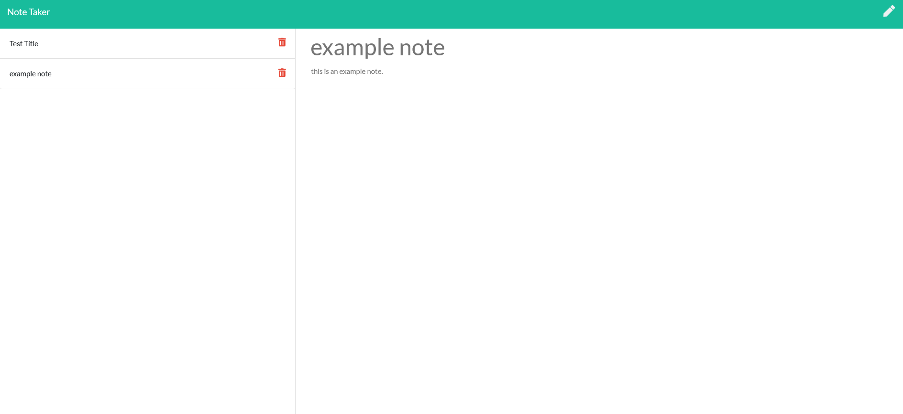

# Note Taker

## Description
A note-taking app using express and uniqid to write notes, save them in a JSON, and delete them from the JSON.

## Usage
* When you load the page, click the "get started" button to open the notes interface. 
* Enter a note title and write something in the body of the note, then save by clicking the save button which appears near the top of the screen.
* The note will be saved on the server in a JSON file.
* To delete a note, click the small red delete button next to the note's title in the list of notes on the left.

